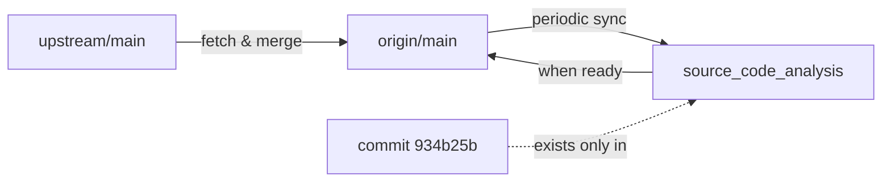

# Spec: Source Code Analysis Branch Management

## Metadata

- **Feature**: Source Code Analysis Branch
- **Status**: Active
- **Owner**: PraMamba
- **Created**: 2025-01-07
- **Last Updated**: 2025-01-07

## Overview

### Purpose

The `source_code_analysis` branch is a dedicated feature branch for maintaining comprehensive FSDP2 (Fully Sharded Data Parallel v2) backend source code analysis documentation for the slime framework. This branch serves as a knowledge repository for infrastructure engineers who want to understand and replicate FSDP2 implementation in other frameworks.

### Target Audience

- Infrastructure engineers implementing FSDP2 backends in new frameworks
- Developers seeking deep understanding of FSDP2 internals
- Contributors maintaining and extending FSDP2 documentation

### Scope

The branch contains 22 comprehensive analysis documents totaling 41,000+ lines of code-level annotations covering:

- FSDP2 core implementation mechanisms
- DeviceMesh and sharding strategies
- Mixed precision policies and memory management
- Data packing and attention mechanisms
- Checkpoint compatibility with HuggingFace
- CPU offload and memory optimization
- Context parallelism and Ring Flash Attention
- Production deployment best practices

## Design

### Document Organization Structure

The documentation follows a structured learning path organized into 7 layers, progressing from beginner to expert level:

```
docs/analysis/
├── README.md                                          # Documentation index and learning paths
├── fsdp2_learning_roadmap_for_infra_beginners.md    # 18,000+ line comprehensive roadmap
├── fsdp2_implementation_deep_dive.md                 # Core implementation details
├── fsdp2_minimal_integration_guide.md                # Quick integration guide
└── [20+ specialized analysis documents]              # Deep-dive topics
```

### Core Document Relationships

#### 1. Entry Point
- **`README.md`**: Provides document index, learning paths, and navigation guide
- Links to all specialized topics with descriptions and recommended reading order

#### 2. Foundation Documents
- **`fsdp2_implementation_deep_dive.md`**: Core FSDP2 mechanisms, DTensor basics, module wrapping strategies
- **`fsdp2_minimal_integration_guide.md`**: Quick-start guide with practical integration steps

#### 3. Specialized Analysis Documents (by category)

**Infrastructure Foundation:**
- `fsdp2_devicemesh_and_sharding_deep_dive.md`: GPU topology and parameter sharding
- `fsdp2_sharding_granularity_analysis.md`: Sharding granularity control and Eager Mode limitations

**Data Processing:**
- `fsdp2_data_packing_attention_and_positions.md`: Data packing and attention computation
- `fsdp2_position_encoding_cu_seqlens_and_loss_computation.md`: Position encoding and loss calculation
- `fsdp2_sequence_balancing_and_oom_handling.md`: Sequence balancing and OOM prevention

**Parallel Communication:**
- `fsdp2_cp_padding_and_ring_flash_attention.md`: Context parallelism padding
- `fsdp2_ring_flash_attention_and_cp_state_maintenance.md`: Ring attention state management
- `fsdp2_embedding_sharding_and_cp_input_splitting.md`: Embedding layer handling
- `fsdp2_communication_overlap_and_memory_management.md`: Communication optimization

**Memory Optimization:**
- `fsdp2_mixed_precision_policy_deep_dive.md`: Mixed precision strategies
- `fsdp2_cpu_offload_async_transfer_and_memory_management.md`: CPU offload mechanisms
- `fsdp2_ref_model_offload_and_memory_fragmentation.md`: Reference model offloading
- `fsdp2_master_weights_gradient_clip_communication.md`: Master weights and gradient management
- `fsdp2_optimizer_state_lifecycle.md`: Optimizer state management
- `fsdp2_sleep_wakeup_and_cpu_offloading.md`: Dynamic sleep/wakeup strategies

**Ecosystem Compatibility:**
- `fsdp2_checkpoint_and_huggingface_compatibility.md`: Checkpoint system and HF integration
- `fsdp2_monkey_patch_mechanism_and_compatibility.md`: Compatibility patches
- `fsdp2_colocated_mode_and_inference_weight_sync.md`: Colocated training/inference

### Relationship with Other Documentation

**`CLAUDE.md`**:
- Provides high-level framework overview and usage guidelines
- Covers all three modules: Training (Megatron), Rollout (SGLang), Data Buffer
- The `source_code_analysis` branch focuses exclusively on FSDP2 backend deep-dive

**Complementary, not redundant:**
- `CLAUDE.md`: "How to use slime framework"
- `docs/analysis/`: "How FSDP2 backend works internally"

## Branch Management Strategy

### Long-term Maintenance

The `source_code_analysis` branch is a **long-lived feature branch** that:

1. **Maintains independent history**: Contains commit 934b25b and all FSDP2 analysis documents
2. **Stays synchronized with upstream**: Regularly merges updates from `upstream/main` to incorporate code changes
3. **Serves as documentation reference**: Can be merged to main when documentation is ready for production

### Synchronization Workflow

#### Regular Updates (Recommended: Weekly or per major release)

```bash
# On source_code_analysis branch
git checkout source_code_analysis
git fetch upstream
git merge upstream/main
# Resolve any conflicts in analysis documents if slime code changed
git push origin source_code_analysis
```

#### When to Merge to Main

Merge `source_code_analysis` into `main` when:
- Documentation has been reviewed and validated
- Analysis is confirmed accurate against current codebase
- Ready for public consumption in official releases

```bash
git checkout main
git merge source_code_analysis
git push origin main
```

### Branching Model



### Commit Convention

Follow conventional commit format for documentation updates:

- `docs(analysis): add new FSDP2 topic analysis`
- `docs(analysis): update checkpoint section with new findings`
- `docs(analysis): fix typos in learning roadmap`
- `docs(analysis): sync with upstream changes in FSDP2 code`

## Non-Goals

This branch explicitly **does not** cover:

1. **Megatron-LM internals**: Analysis focuses on FSDP2 wrapper, not Megatron core
2. **SGLang internals**: Inference engine is out of scope
3. **Training scripts**: No executable code, only documentation
4. **Other parallelism strategies**: DDP, Tensor Parallel, Pipeline Parallel are not covered
5. **Algorithm implementations**: GRPO, PPO, GSPO algorithms are not analyzed

## Acceptance Criteria

### Document Quality Standards

Each analysis document must:

1. **Include specific code references**:
   - Exact file paths (e.g., `slime/backends/fsdp2_backend/actor.py:1016-1057`)
   - Line numbers for critical implementation details
   - Links to source code where applicable

2. **Provide performance analysis**:
   - Communication overhead calculations
   - Memory consumption estimates
   - Concrete numerical examples (e.g., "7B model, seq_len=4096, dp=4")

3. **Include practical examples**:
   - Configuration snippets
   - Command-line arguments
   - Integration code samples

4. **Maintain consistency**:
   - Follow established document structure
   - Use consistent terminology
   - Cross-reference related documents

### Validation Requirements

Before merging to main:

- [ ] All code references are accurate and up-to-date
- [ ] Performance calculations verified against actual runs
- [ ] Integration examples tested with current slime version
- [ ] Cross-references between documents are valid
- [ ] No broken links or missing sections
- [ ] Learning roadmap reflects current document structure

## Testing

### Documentation Verification

1. **Link Validation**:
   ```bash
   # Check all internal links
   grep -r "\[.*\](.*\.md)" docs/analysis/ | verify-links
   ```

2. **Code Reference Validation**:
   ```bash
   # Verify referenced line numbers exist
   python tools/verify_code_refs.py docs/analysis/
   ```

3. **Build Documentation**:
   ```bash
   cd docs
   bash build.sh
   # Verify no Sphinx warnings
   ```

### Content Review Checklist

For each document:
- [ ] Code snippets are syntactically correct
- [ ] File paths and line numbers are accurate
- [ ] Performance numbers are reproducible
- [ ] Examples run without errors
- [ ] Terminology is consistent with other docs

## Migration Strategy

### Phase 1: Initial Setup (Completed)

- [x] Create `source_code_analysis` branch from commit 934b25b
- [x] Set up Lean Spec structure (`.lean-spec/`, `specs/`)
- [x] Align `origin/main` with `upstream/main`
- [x] Push branch to remote

### Phase 2: Maintenance (Ongoing)

- [ ] Regular sync with upstream/main (weekly)
- [ ] Update analysis when slime FSDP2 code changes
- [ ] Add new analysis documents for new FSDP2 features
- [ ] Respond to community feedback and questions

### Phase 3: Production Integration (Future)

- [ ] Comprehensive review of all documents
- [ ] Validation of all code references and examples
- [ ] Community preview and feedback collection
- [ ] Merge to main when ready for official release

## Implementation Details

### Branch Structure

```
source_code_analysis/
├── .lean-spec/
│   └── config.json              # Lean Spec configuration
├── specs/
│   └── source_code_analysis.md  # This specification document
├── docs/
│   └── analysis/
│       ├── README.md            # 22 FSDP2 analysis documents
│       └── fsdp2_*.md
└── [rest of slime codebase]
```

### Git History

```
upstream/main (9d7f34d)
    │
    ├── origin/main (aligned, force-pushed)
    │
    └── source_code_analysis
            │
            └── commit 934b25b (FSDP2 docs)
                    │
                    └── Lean Spec setup
```

### Key Commands Reference

**Create branch** (already done):
```bash
git checkout -b source_code_analysis
```

**Sync with upstream**:
```bash
git fetch upstream
git merge upstream/main
```

**Push to origin**:
```bash
git push origin source_code_analysis
```

**Align main with upstream** (already done):
```bash
git checkout main
git reset --hard upstream/main
git push origin main --force
```

## Dependencies

### Required Tools

- Git 2.30+
- Python 3.8+ (for validation scripts)
- Sphinx (for documentation building)

### External References

- [Lean Spec Documentation](https://www.lean-spec.dev/)
- [THUDM/slime Repository](https://github.com/THUDM/slime)
- [PyTorch FSDP2 Documentation](https://pytorch.org/docs/stable/fsdp.html)

## Future Enhancements

### Planned Additions

1. **Interactive Examples**: Jupyter notebooks demonstrating FSDP2 concepts
2. **Video Tutorials**: Walkthrough videos for complex topics
3. **Benchmarking Suite**: Reproducible performance benchmarks
4. **Comparison Guide**: FSDP1 vs FSDP2 detailed comparison
5. **Migration Guide**: Steps to migrate from DDP/FSDP1 to FSDP2

### Community Contributions

Welcome contributions that:
- Add new analysis for FSDP2 features
- Improve clarity and accuracy of existing docs
- Provide additional examples and use cases
- Translate documentation to other languages

## References

### Primary Source Files

- `slime/backends/fsdp2_backend/actor.py`: Main FSDP2 implementation
- `slime/backends/fsdp2_backend/checkpoint.py`: Checkpoint handling
- `slime/backends/fsdp2_backend/utils.py`: Helper utilities

### Related Documentation

- [CLAUDE.md](../CLAUDE.md): Slime framework overview
- [docs/analysis/README.md](../docs/analysis/README.md): FSDP2 documentation index
- [docs/grpo/](../docs/grpo/): GRPO training guide

## Changelog

### 2025-01-07 - Initial Setup

- Created `source_code_analysis` branch
- Added Lean Spec structure
- Created comprehensive specification document
- Set up branch management workflow
- Aligned `origin/main` with `upstream/main`

---

**Note**: This specification follows Lean Spec guidelines for clear, actionable, and maintainable project specifications. For updates or questions, contact the branch owner or open an issue in the repository.
